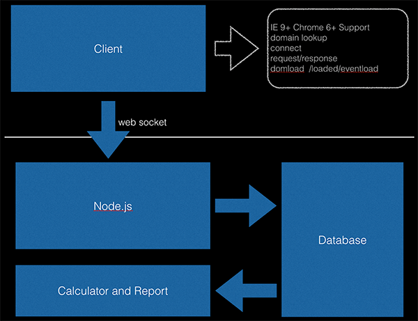

# Device and Worker for Blackbox

我们希望提供一个工具，可以实现：

1. 记录代码片段执行时间，记录页面整体执行时间，记录各模块执行时间。
2. 实时将收集的数据以图表形式展示在页面
3. 不达标的页面可以找到更具代表性的完整日志记录

而此项目包含了接收数据和分析数据两部分工作。

## 安装

### 1. 安装 [virtualenv](http://www.virtualenv.org/en/latest/)

```
$ pip install virtualenv
# or
$ easy_install virtualenv


$ virtualenv --no-site-packages .virtualenv
```

### 2. 安装 [ve](https://github.com/erning/ve)

```
$ curl -kL "http://git.io/ve" -o "$HOME/bin/ve"
```

### 3. 安装项目依赖

```
$ ve python setup.py develop
```

### 使用

参考后面的使用章节，在命令前带 `ve` 命令，例如

```
$ ve bbctl start

# 指定覆盖配置文件
$ BLACKBOX_CONFIG=blackbox.conf ve bbctl start
```

## 线上部署

使用 [capistrano 的脚本](http://git.corp.anjuke.com/leichen_sh/Capfile)。

## 使用

```
bbctl start
bbctl stop
bbctl reload
bbctl status
```

## 远程reload

```
$ bin/python src/test/reload.py
```

## Prism

在安居客，性能优化是永恒的话题，现在，我们不光只满足于后端速度的200ms，还需要离用户更近一步，着眼于用户最终看到页面时的感受，把手伸向前端的性能优化。



### 目标

+ 对前端性能进行监控
+ 对前端性能制定优化方案

### 项目成员
* BO: 杨勇
* TO: 时先进
* 组员：吕秀英、李唐俊、吴佳雷、许胜斌、孙红玉
* 项目详情：<http://git.corp.anjuke.com/xianjingshi/Prism>
* URL：<http://prism.corp.anjuke.com>

### 成员分工
+ 收集模块负责人：李唐俊 吴佳雷
+ 计算，汇总，展示：孙红玉 许胜斌
+ QA：吕秀英

###开发计划

+ 第一期开发一个监控前端性能工具

>>>>>>> myfirst commit
